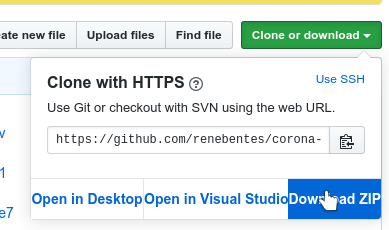
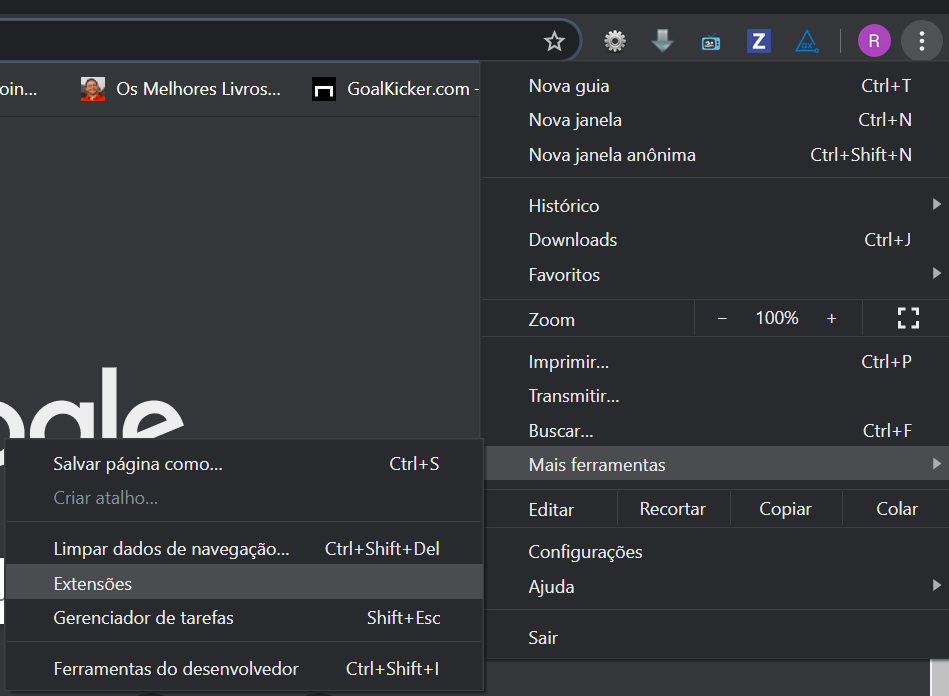

# Corona-Cleaner

> Extensão do Chrome para a cura do Coronavírus na Internet.

## Objetivo

Remover as menções ao Coronavírus do conteúdo das páginas na Internet.

## Features

- Localizar as menções ao Coronavírus
- Aplicar a vacina

## Como usar

- Faça download da última versão da extensão direto

- Extraia a os arquivos da extensão para uma local de fácil acesso

- Abra a página de Extensões do Chrome

- Ative o Modo Desenvolvedor

- Carregue a extensão sem compactação e selecione a pasta extraída no passo [1]

- Agora navegue curado do Coronavírus :)

---

## Ícone

[Coronavirus icon](https://icons8.com.br/icons/set/coronavirus) por [Icons8](https://icons8.com.br)
